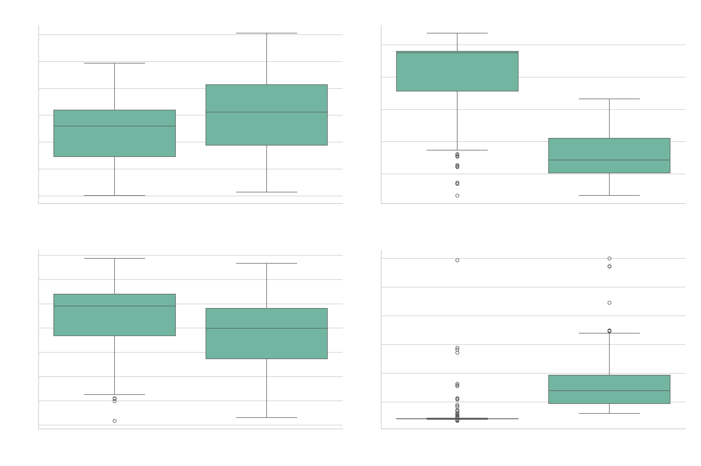
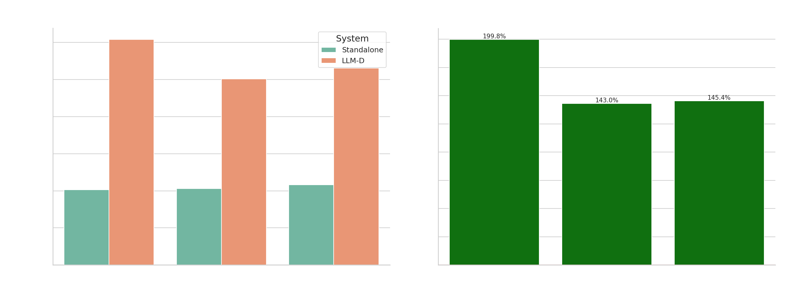
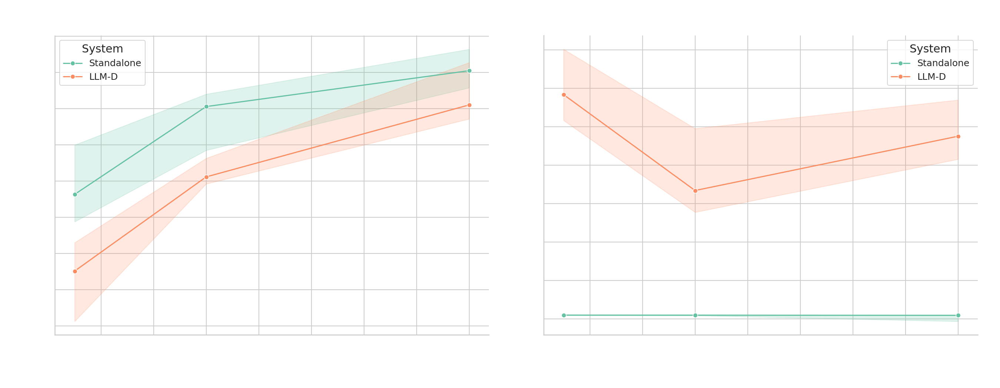

# Benchmark Comparison Analysis

This directory contains visualization files comparing the performance between two LLM deployments.

## Latency Comparison

This plot shows four key latency metrics compared between the two systems:

1. **Time to First Token (TTFT) Comparison**
   - Shows how quickly each system starts generating tokens
   - Lower values indicate faster initial response

2. **Generation Time Comparison**
   - Shows the time taken to generate the complete response
   - Helps identify performance differences in generation speed

3. **Total Time Comparison**
   - Shows the complete end-to-end latency
   - Combines initial response time and generation time

4. **Token Generation Rate Comparison**
   - Shows how many tokens are generated per second
   - Higher values indicate better throughput

## Throughput Comparison

This plot compares throughput-related metrics between the systems:

1. **Throughput (Tokens/Second) Comparison**
   - Shows the overall token processing rate for each system
   - Combines both prompt and generation tokens
   - Higher values indicate better performance

2. **Relative Performance Improvement**
   - Shows the percentage improvement of one system over the other
   - Helps quantify the efficiency gains

## QPS Comparison

This plot shows how each system performs at different QPS (Queries Per Second) levels:

1. **Latency vs QPS Comparison**
   - Shows how response time increases with higher query loads
   - Helps identify at which point each system begins to degrade

2. **Token Rate vs QPS Comparison**
   - Shows how token generation speed changes with increasing load
   - Helps identify maximum effective throughput for each system
